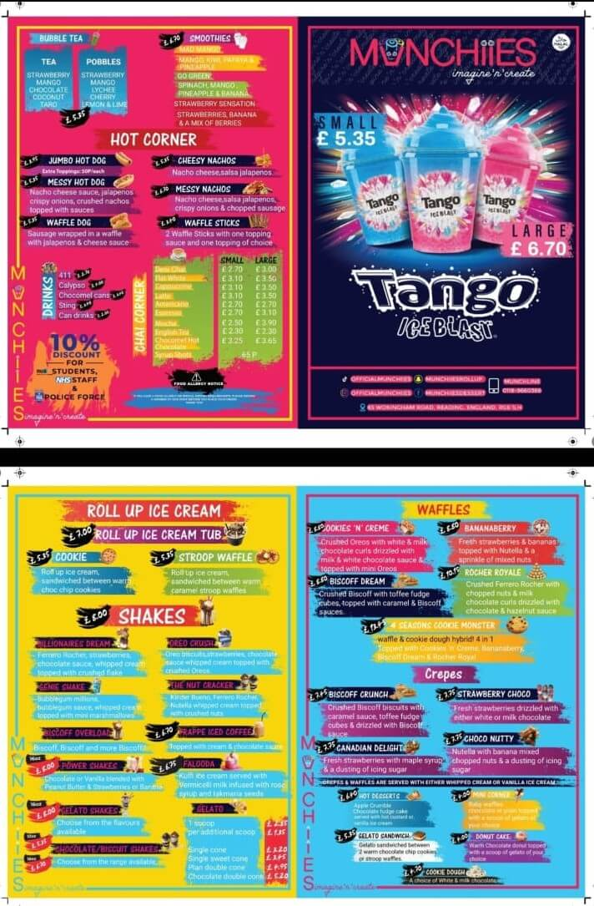
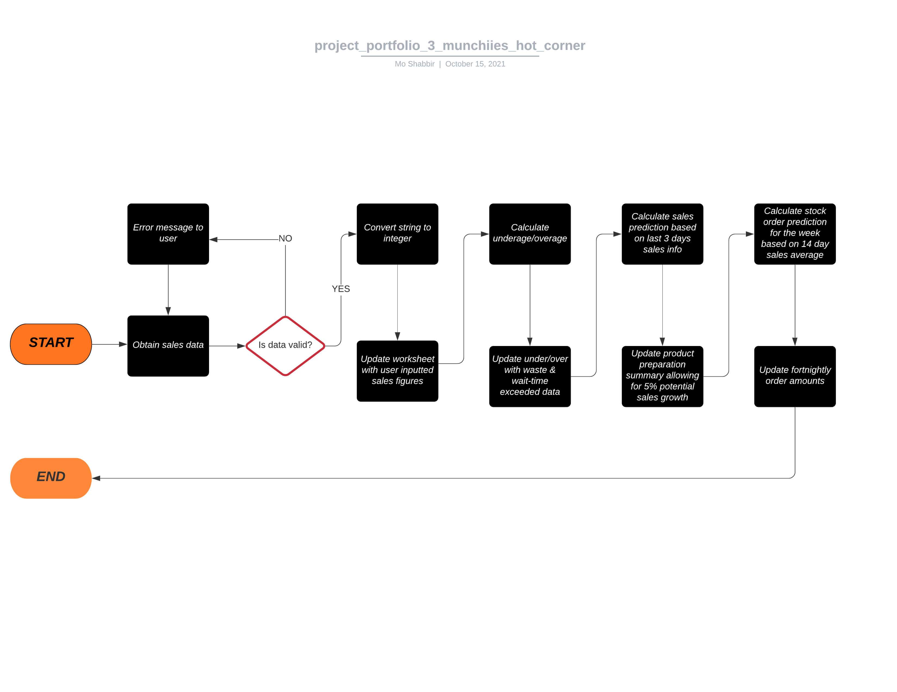
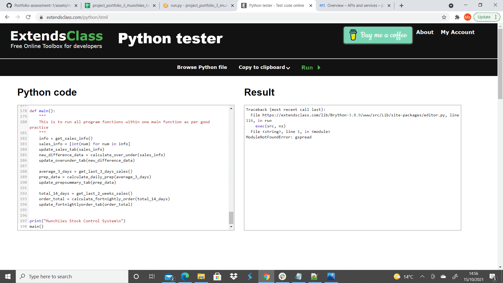
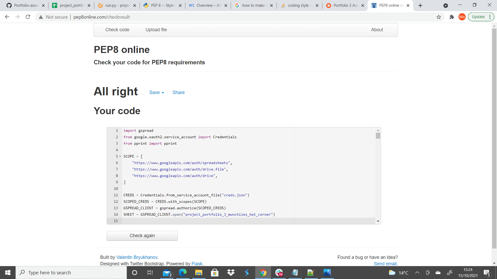

# PORTFOLIO-ASSESSMENT-3-MUNCHIIES-HOT-CORNER
* Python stock management system for independent trader in Reading
## User/Business owner Objectives-
* The owner wants to obtain insights from sales, wastage and unfulfilled order data in order to improve hot corner product availabililty.
* The user wishes to reduce customer wait times for hot products.
* The owner desires to minimise wastage whilst ensuring product quality.
* The owner requires to be able to respond to changes in sales demand & seasonality without having money tied up in excess stock for too long a duration or unfulfilled sales due to underordering from supplier.
## Site Owner Objectives-
* The application should provide extrapolated data from an inputted dataset whilst logging data into an accessible format for the business owner to understand and make subsequent business decisions.
## Background-
* Munchiies is an independant dessert parlour based in the RG6 area of Berkshire. Whilst predominantly selling cold products there are also hot items on the menu namely under the section of the menu called "Hot Corner".
* The business owner has stated that this part of the menu can be problematic to manage in that the products can take time to prepare which can cause excessive wait times for customers which is exacerbated when the business has moved more towards online delivery platforms such as Deliveroo, Just Eat and Uber-Eats etc... which rate business on speed of service and compliance to those benchmarked metrics.
* In the event the preparation can be speeded up by using a microwave instead of the slower heating methods, product quality is detrimentally affected which impacts customer perception.
* Constantly having hot products being prepared results in excess wastage at the end of the day which impacts bottoms line profit.
* The business owner is concerned that he may be ordering too much or too little stock from suppliers and collation of the data to make a strategic decision can be very time consuming for a business that trades 12hrs per day with a maximum of 3 staff at any given point.
## Menu

## Process flowchart mockup

## FEATURES
* Import survey results from the terminal to the google spreadsheet and individual worksheets within it.
* Take data from worksheets and peform calculations on it in order to provide information for the business to respond.
* The app has been made to address a real world problem affecting an independant business.

## LANGUAGES-
* [PYTHON] (https://en.wikipedia.org/wiki/Python_(programming_language))

## LIBRARIES & PROGRAMS-
* [Google Drive:](https://en.wikipedia.org/wiki/Google_Drive) Google drive was used to store the spreadsheet which was accessed by the app.
* [Google API's:](https://en.wikipedia.org/wiki/Google_APIs) Google API's were used to validate access to the relevant worksheets and be able to edit them directly from the command line.
* [TinyPNG](https://tinypng.com) TinyPNG was used to compress image sizes to be used in the readme.md file
* [NodeJS](https://en.wikipedia.org/wiki/Node.js) NodeJS used as part of the buildpack used when deploying project to Heroku.
* [CodeBeautify](https://codebeautify.org/python-formatter-beautifier) Used to tidy the python 3.6 code to be according to presentation standards.

### TESTING-
* Tested through [ExtendsClass.com](https://www.extendsclass.com/python.html) which showed there was no error with the code itself although did show that the gspread module was not found which is not the case in the actual file itself.

* Run through the [PEP8 online checker](http://www.pep8online.com/checkresult) which showed no issues with formatting and was used to help meet coding convention.

## Bugs- 
* <!--Complete this section>

### DEPLOYMENT-
The project was deployed in 2 stages, the first of which being on Heroku and the second being on Github pages and this is detailed below:

The project was deployed to Heroku using the following procedure:
* <!--Complete this section>
The project was deployed to GitHub Pages using the following procedure:
* Logged in to github and selected the github repository required.
* Selected the settings option.
* Went to the github pages section.
* Under the source tab the dropdown "none" was changed to "master branch".
* The page then refreshed.
* The gihub pages section then had a link to the published page.

### CREDITS-<!--Complete this section>
* My mentor Can Sucullu who helped me break down my project idea into the key aspects that I had to ensure were part of the final submission.
* Code Institute's "Love Sandwiches" walkthrough which had code that I was able to adapt for use in my own project namely one of each i of the "get" "calculate" & "update" functions which once understood were rewritten to be applicable to this project requirements and functionality.

### CONTENT & MEDIA-
* All photos and marketing materials are copyright of the respective copyright holders and taken with permission of the trademark owner. All images were all compressed to aid in readme.md page load speed.

### OPPORTUNITIES-
* The spreadsheet can be expanded to hold more information allowing for pre-preparation on other hot products such as waffles and crepes that are hot parts of desserts. This would in turn aid turnover speed on dessert products also.
* There is another opportunity whereby over a period of time as more data is obtained that code can be rewritten to allow for usage plus safety stock to prevent "out of stocks".
* I would have liked to have individual input requests for each product's sales in order to make the interface more user friendly and would have linked that by appending not the entire row but the INDIVIDUAL entry in the list within the row. This is soemthing I was not able to do due to the lack of time left till submission but is definatley something I will be exploring as I have already been asked to add this functionality for the business after my course is complete.
* I would have like to have been confident enough to be able to refactor the code to combine functionality of the similar functions but as I am only just understanding the long hand syntax I would like to embed this in my mind with regards to keeping functions individual for the moment until I am able to spend more time practising code refactoring.

<!--Delete everything below this before submission and after adherance-->

Welcome moshabbir-dotcom,

This is the Code Institute student template for deploying your third portfolio project, the Python command-line project. The last update to this file was: **August 17, 2021**

## Reminders

* Your code must be placed in the `run.py` file
* Your dependencies must be placed in the `requirements.txt` file
* Do not edit any of the other files or your code may not deploy properly

## Creating the Heroku app

When you create the app, you will need to add two buildpacks from the _Settings_ tab. The ordering is as follows:

1. `heroku/python`
2. `heroku/nodejs`

You must then create a _Config Var_ called `PORT`. Set this to `8000`

If you have credentials, such as in the Love Sandwiches project, you must create another _Config Var_ called `CREDS` and paste the JSON into the value field.

Connect your GitHub repository and deploy as normal.

## Constraints

The deployment terminal is set to 80 columns by 24 rows. That means that each line of text needs to be 80 characters or less otherwise it will be wrapped onto a second line.

-----
Happy coding!